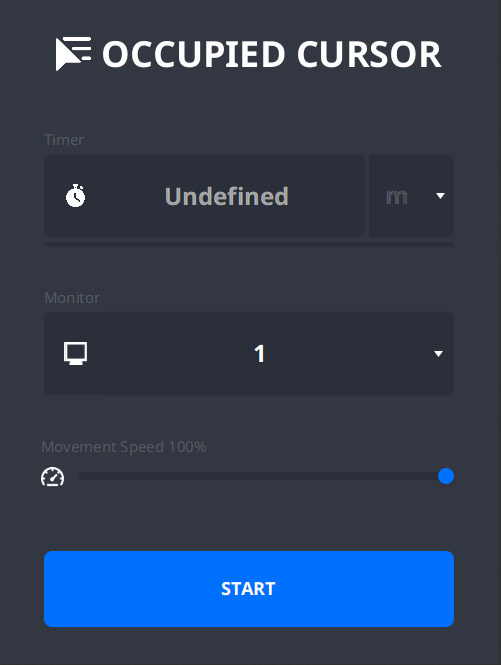

# Occupied Cursor

## Description
**Occupied Cursor** is a personal project where the goal is to occupy the cursor automatically. The tool is not necessarily a very useful tool but it  does exactly what the name suggests it does. The tool is created using **Java** & [**JavaFX**](https://openjfx.io/).

## Preview

## Building
### You can download the project binary from [here](https://github.com/suddin0/occupied_cursor/releases/)
1. To build the project you will nead [Maven](https://maven.apache.org/)
   1.1 Download the project from github `git clone https://github.com/suddin0/occupied_cursor`
   1.2 Go to the root of the project `cd occupied_cursor`
   1.3 Run the project `mvn clean javafx:run`
   1.4 **OR** build the project using [jlink](https://docs.oracle.com/en/java/javase/11/tools/jlink.html) using the following command `mvn clean javafx:jlink`

